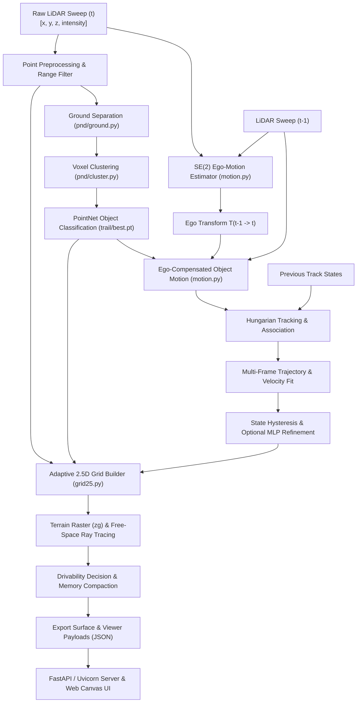

# Adaptive Variable-Resolution 2.5D Semantic LiDAR Mapping System

**Autonomous Perception, Terrain Elevation Modeling, SE(2) LiDAR Ego-Motion, and Temporal Object Motion Tracking**

---

## Table of Contents

1. [Project Overview](#1-project-overview)
2. [System Architecture](#2-system-architecture)
3. [LiDAR Input and Preprocessing](#3-lidar-input-and-preprocessing)
4. [Semantic / Object Detection](#4-semantic--object-detection)
5. [Adaptive Variable-Resolution 2.5D Representation](#5-adaptive-variable-resolution-25d-representation)
6. [Ego-Motion Estimation](#6-ego-motion-estimation)
7. [Ego-Compensated Object Motion Detection](#7-ego-compensated-object-motion-detection)
8. [Temporal Object Tracking](#8-temporal-object-tracking)
9. [Trajectory and Relative Velocity Estimation](#9-trajectory-and-relative-velocity-estimation)
10. [Motion-State Hysteresis](#10-motion-state-hysteresis)
11. [Motion MLP Refinement](#11-motion-mlp-refinement)
12. [Ground-Truth / Evaluation Mode](#12-ground-truth--evaluation-mode)
13. [Data Handling and Frame Processing](#13-data-handling-and-frame-processing)
14. [Web Server and Visualization](#14-web-server-and-visualization)
15. [Validation and Testing](#15-validation-and-testing)
16. [Performance](#16-performance)
17. [Current Limitations](#17-current-limitations)
18. [Current Project State](#18-current-project-state)
19. [File / Module Architecture](#19-file--module-architecture)
20. [How to Run the Project](#20-how-to-run-the-project)
21. [Development History — Condensed](#21-development-history--condensed)

---

## 1. Project Overview

Autonomous ground vehicles operating in unstructured, dynamic, or GPS-denied environments require real-time spatial representations that balance geometric fidelity, semantic awareness, motion reasoning, and computational bandwidth. Raw 3D LiDAR point clouds provide dense spatial sampling (~120,000 points per sweep at 10 Hz, generating ~20 MB/s of unstructured data). However, raw point clouds cannot be directly queried by real-time path planners, cannot be transmitted over low-bandwidth tactical radio links, and consume excessive memory when maintained across large geographical areas.

This project implements a complete, integrated software framework for **Adaptive Variable-Resolution 2.5D Semantic LiDAR Mapping with Temporal Motion Reasoning**. The system converts raw continuous 3D LiDAR sweeps into compact, queryable 2.5D elevation maps enhanced with drivability analysis, semantic class distributions, LiDAR-only sensor ego-motion, ego-compensated object residuals, persistent multi-frame tracking, and trajectory-based dynamic state estimation.

```
+---------------------------------------------------------------------------------------------------+
|                                 INTEGRATED PERCEPTION PIPELINE                                    |
|                                                                                                   |
|  Raw 3D LiDAR Scan (N, 4) ---> Geometric Ground Separation & PointNet Object Proposals            |
|                                         |                                                         |
|                                         v                                                         |
|  Planar SE(2) LiDAR Ego-Motion Estimation (Phase Correlation + Trimmed Inlier ICP)                |
|                                         |                                                         |
|                                         v                                                         |
|  Ego-Compensated Spatial Residuals ---> Hungarian Object Association & Multi-Frame Trajectories  |
|                                         |                                                         |
|                                         v                                                         |
|  Adaptive Variable-Resolution 2.5D Grid (Foveated Tiers: 5 cm / 10 cm / 20 cm / 40 cm)           |
|                                         |                                                         |
|                                         v                                                         |
|  Multi-Layer Map Output: Elevation, Terrain Zg, Clearance, Drivability, Semantics, Dynamic State  |
+---------------------------------------------------------------------------------------------------+
```

### Core Concepts

* **Why a 2.5D Representation?** Fully 3D voxel grids (e.g., dense occupancy voxels) suffer from cubic memory growth $O(L \cdot W \cdot H)$, with over 99% of voxels representing unobserved or empty space. A 2D grid discards vertical geometry entirely, failing to represent ground slope, kerb steps, potholes, or drive-under overhangs (such as bridges or gantries). A 2.5D grid stores height summaries (lowest return, highest return, terrain elevation, clearance, roughness, and class histograms) for each spatial column $(x, y)$, retaining essential 3D drivability and clearance constraints with the planar memory footprint of a 2D raster.
* **What is "Adaptive Variable Resolution"?** LiDAR beam density decreases quadratically with radial distance from the sensor. Near the vehicle ($< 10\text{ m}$), points land millimeters apart, justifying fine spatial discretization ($5\text{ cm}$). Far away ($> 50\text{ m}$), laser beams are separated by meters; assigning fine cells produces isolated single-point cells with zero surface context. The adaptive grid organizes space into concentric, foveated power-of-two tiers ($5\text{ cm}, 10\text{ cm}, 20\text{ cm}, 40\text{ cm}$), maintaining fine detail where sampling is dense and aggregating sparse far-field returns into statistically meaningful cells.
* **Semantic Layering**: Rather than forcing a single hard label per cell, each cell maintains an 8-class histogram across ground, road, building, pole, vegetation, car, pedestrian, and cyclist. Crucial safety-critical classes (pedestrians and cyclists) use priority override rules so small obstacles are never obscured by dominant background returns.
* **LiDAR-Only Motion Awareness**: The system does not depend on external GNSS/IMU odometry or precomputed poses. It estimates 3-DoF planar sensor ego-motion ($\Delta x, \Delta y, \Delta \theta$) directly from consecutive point clouds, compensates for sensor displacement, calculates spatial nearest-neighbor residuals on detected object clusters, tracks objects over multi-frame sliding windows using Hungarian matching, fits linear trajectories, and classifies objects as `STATIC` or `DYNAMIC` with directional consistency validation and optional neural MLP refinement.

---

## 2. System Architecture

The end-to-end processing pipeline executes synchronously or asynchronously per frame through an integrated computational flow:



### Execution Flow Breakdown

1. **Scan Ingestion**: A raw LiDAR point cloud ($\sim 120\text{k}$ points) is loaded from local disk or fetched via asynchronous HTTP range reads from remote dataset archives.
2. **Geometric Ground Removal & Clustering**: Points are segmented into ground and non-ground candidates using surface normal fitting. Non-ground points are grouped into spatially contiguous clusters via voxel connected components.
3. **Semantic Proposal Inference**: Clusters with $\ge 20$ points are normalized with deterministic yaw PCA (`pca2_yaw`) and classified by a lightweight PointNet backbone into `Background`, `Car`, `Pedestrian`, or `Cyclist`.
4. **Planar SE(2) Ego-Motion Estimation**: Consecutive full point clouds are projected onto a 2D BEV grid. Planar translation is initialized using 2D Fourier phase correlation and refined alongside yaw via trimmed point-to-point ICP.
5. **Ego-Compensated Spatial Residuals**: The previous scan is transformed into the current frame coordinate system using the estimated ego transform. For each detected object cluster, point-to-point nearest-neighbor Euclidean distances are computed to isolate object displacement from sensor motion.
6. **Temporal Object Tracking**: Current object clusters are associated with persistent tracks using Hungarian bipartite matching on ego-compensated centroids with distance gating and semantic class consistency.
7. **Trajectory & Relative Velocity Fitting**: Multi-frame centroid histories are transformed into the current frame. Linear least-squares trajectory fitting over sliding windows ($N \le 10$) estimates vector relative velocities, speeds ($\text{m/s}$ and $\text{km/h}$), direction consistency, and trajectory RMSE.
8. **Motion-State Hysteresis & Optional MLP**: A state-machine enforces multi-frame promotion and demotion rules to prevent classification flickering. An optional 20-feature neural MLP provides refined probability estimates.
9. **Adaptive 2.5D Grid Generation**: All points are quantised into a base $5\text{ cm}$ grid. Cells are aggregated into nested power-of-two blocks based on radial distance. Terrain elevation rasters ($25\text{ cm}$) and suffix-minimum free-space visibility tables are constructed.
10. **Map Synthesis & Delivery**: Clearance, obstacle height, pothole depth, bumpiness, drivability, semantic class, and motion status are compiled per cell, serialized into binary/JSON payloads, and streamed via Server-Sent Events (SSE) to the interactive browser client.

---

## 3. LiDAR Input and Preprocessing

### Input Data Format
* **Point Cloud Representation**: Standard KITTI / SemanticKITTI binary Velodyne format (`.bin`). Each file contains an uncompressed stream of IEEE 754 single-precision floating-point values representing $[x, y, z, r]$, where $x, y, z$ are Cartesian coordinates in meters and $r \in [0.0, 1.0]$ is reflectance/intensity.
* **Scan Size**: Approximately $115,000$ to $130,000$ points per sweep ($1.8\text{ MB}$ to $2.1\text{ MB}$ per file), captured at $10\text{ Hz}$ with a 64-beam Velodyne HDL-64E spinning LiDAR.
* **Coordinate Conventions**:
  * $+X$: Forward along vehicle heading
  * $+Y$: Leftward perpendicular to vehicle heading
  * $+Z$: Upward perpendicular to the road plane
  * Sensor Origin $(0, 0, 0)$: Situated at the optical center of the roof-mounted Velodyne scanner ($\sim 1.73\text{ m}$ above the nominal road surface).

### Preprocessing Operations
1. **Range Filtering**: Points exceeding the maximum map horizon ($R > 70.0\text{ m}$ or configurable $100.0\text{ m}$) are excluded: $R = \sqrt{x^2 + y^2} \le R_{\max}$.
2. **Nan/Inf Sanitization**: Non-finite float entries and points within the vehicle's own roof bounding radius ($R < 0.8\text{ m}$) are purged.
3. **Geometric Ground Separation**: Executed in `trail/pointnet-det/src/pnd/ground.py` using a fast vectorized surface-normal and height-thresholding kernel. Points satisfying height proximity to the estimated road plane ($z < z_{\text{ground}} + \Delta z$) and local flatness constraints are tagged as ground candidates, providing the initial partition for cluster extraction.

---

## 4. Semantic / Object Detection

The semantic object detection pipeline (`predict.py`, `trail/best.pt`) is designed as a **cluster-wise 3D object classifier**, not a dense per-point semantic segmentation network. This architectural distinction is critical for computational efficiency.

```
Raw Non-Ground Points ---> Voxel Connected Components (20 cm) ---> Clustered Proposals
                                                                         |
                                                                         v
Oriented Bounding Box <--- PointNet Classification & Box Head <--- Deterministic PCA2 Yaw
```

### Detection Pipeline Stages
1. **Ground Removal**: Ground points are isolated geometrically, leaving non-ground obstacle candidates.
2. **Voxel Connected Components**: In `trail/pointnet-det/src/pnd/cluster.py`, non-ground points are discretized into $20\text{ cm}$ voxel indices and grouped into spatially contiguous clusters using 26-neighbor connected components.
3. **Proposal Filtering**: Clusters with fewer than $20$ points are dropped before inference to prevent noise artifacts. Clusters with $> 1024$ points are uniformly subsampled to $512$ or $1024$ points for batch tensor ingestion.
4. **Deterministic Canonicalization (`pca2_yaw`)**: Rather than running an expensive learned 3×3 spatial transformer network (T-Net), the detector uses deterministic 2D Principal Component Analysis on the horizontal $(x, y)$ coordinates. This aligns the proposal's primary horizontal axis along the x-axis while preserving the physical gravity vector $(z)$ and vertical height metrics.
5. **PointNet Backbone & Heads**: The canonicalized cluster coordinates and normalized relative features are processed by shared multi-layer perceptrons ($64 \to 128 \to 1024$), max-pooled into a global cluster descriptor, and passed to classification and 3D bounding box regression heads.
6. **Target Classes**:
   * `0: Background` (Structures, poles, traffic signs, untracked clutter)
   * `1: Car` (Automobiles, vans, trucks, buses)
   * `2: Pedestrian` (Walking or stationary persons)
   * `3: Cyclist` (Bicycles, motorcycles, riders)
7. **Semantic Provenance Tracking**: Points are assigned categorical provenance flags (`ground`, `examined_rejected`, `car`, `pedestrian`, `cyclist`, `never_clustered`) so that clustering blind spots ($< 20$ points) remain transparent in the diagnostic viewer.

---

## 5. Adaptive Variable-Resolution 2.5D Representation

The 2.5D mapping engine (`grid25.py`) converts arbitrary point sets into structured multi-layer surface maps.

```
       [40 cm Tier: > 50 m]
       +------------------------------------+
       |   [20 cm Tier: 25 - 50 m]          |
       |   +----------------------------+   |
       |   |   [10 cm Tier: 10 - 25 m]  |   |
       |   |   +--------------------+   |   |
       |   |   | [5 cm: < 10 m]     |   |   |
       |   |   |       (X) Ego      |   |   |
       |   |   +--------------------+   |   |
       |   +----------------------------+   |
       +------------------------------------+
```

### Power-of-Two Resolution Tiers
The horizontal space is partitioned into four nested resolution levels:

| Tier Level (`lvl`) | Distance Range | Cell Resolution ($\Delta s$) | Block Grouping |
| :---: | :---: | :---: | :---: |
| **Level 0** | $0.0\text{ m} \le R < 10.0\text{ m}$ | **$5\text{ cm}$** ($0.05\text{ m}$) | $1 \times 1$ base cell |
| **Level 1** | $10.0\text{ m} \le R < 25.0\text{ m}$ | **$10\text{ cm}$** ($0.10\text{ m}$) | $2 \times 2$ merge ($4$ children) |
| **Level 2** | $25.0\text{ m} \le R < 50.0\text{ m}$ | **$20\text{ cm}$** ($0.20\text{ m}$) | $4 \times 4$ merge ($16$ children) |
| **Level 3** | $R \ge 50.0\text{ m}$ | **$40\text{ cm}$** ($0.40\text{ m}$) | $8 \times 8$ merge ($64$ children) |

### Two-Pass Quantization & Block-Level Sizing
* **Pass 1 (Finest Grid Quantization)**: Every point $(x, y, z)$ is mapped directly into a $5\text{ cm}$ cell index without evaluating radial distance:
  $$i_x = \lfloor x / 0.05 \rfloor, \quad i_y = \lfloor y / 0.05 \rfloor$$
  Each base cell accumulates exact mergeable statistics.
* **Pass 2 (Block-Level Aggregation)**: Distance boundaries are circular, whereas grid blocks are square. Deciding cell size per point or per fine cell causes boundary straddling, where parent and child cells claim overlapping spatial footprints. To prevent footprint overlap, `grid25.blocklevel()` evaluates the **closest spatial point of the entire block** to the sensor. A block coarsens only if its entire footprint lies beyond the tier boundary; if any corner reaches into a finer ring, the entire block remains fine. This guarantees **zero overlapping footprints** and strictly monotonic resolution boundaries.

### Mergeable Cell Accumulators
Cells store raw sums rather than means or variances, allowing hierarchical merging across tiers with zero arithmetic error:
* `n`: Total points in cell
* `zmin`, `zmax`: Absolute vertical bounding interval
* `zomin`: Lowest non-ground point (obstacle bottom)
* `zsum`, `zsq`: Sum of heights $\sum z$ and sum of squared heights $\sum z^2$
* `ng`: Number of ground/road points
* `gmin`: Lowest ground point
* `gsum`, `gsq`: Sum of ground heights $\sum z_g$ and $\sum z_g^2$
* `hist[8]`: Full tally of points across the 8 semantic classes

$$\text{Mean } \mu = \frac{\sum z}{n}, \quad \text{Variance } \sigma^2 = \frac{\sum z^2}{n} - \mu^2$$

### Terrain Reference Surface ($z_g$) & Discontinuity Separation
To measure physical obstacle heights, kerb steps, and potholes relative to the ground, a continuous 2D terrain elevation raster is constructed on a uniform $25\text{ cm}$ grid using ground-classified points:
* **Kerb vs. Pothole Dual Reference**: A kerb is a localized ground step; measuring it against a smoothed road profile yields $\approx 0$. Kerbs are detected by comparing local minimums over a $1\text{ m}$ window. A pothole is an indentation; it is detected by comparing cell elevation against a coarse road trend smoothed over a $4\text{ m}$ window.
* **Median Filter Smoothing**: Median filtering is used instead of Gaussian/box blurring to eliminate noise spikes while preserving sharp vertical kerb edges ($15\text{ cm}$).
* **Honesty Map (`gdist`)**: Only $\sim 9\%$ of $25\text{ cm}$ patches receive direct ground returns. The remainder interpolate from the nearest observed ground patch. A parallel distance grid (`gdist`) records interpolation distance; cells where $\text{gdist} > 2.0\text{ m}$ are marked as `unknown` and barred from positive drivability claims.

### Free-Space Visibility Verification (`raylow`)
To distinguish drive-under overhangs (gantries $> 2.2\text{ m}$) from distant vertical walls, the engine proves that low space was physically swept by laser rays:
* **Elevation Tangent Suffix-Minimum**: Rather than stepping through 3D voxel rays ($18\text{M}$ steps/frame), every LiDAR return $(R, Z)$ defines an elevation ray slope $s = Z / R$. In each discrete azimuth bin ($N_{\text{az}} = 1024$), a 1D running suffix-minimum of ray slopes is computed from far to near.
* The lowest ray height passing over column at distance $r$ is:
  $$Z_{\text{beam}}(r) = r \cdot \min_{R_i > r + 0.5\text{ m}} \left(\frac{Z_i}{R_i}\right)$$
  If $Z_{\text{beam}}(r) - z_g(r) < 2.2\text{ m}$, the column is verified as swept. A $0.5\text{ m}$ standoff range gap (`rgap`) prevents grazing-angle wall returns from falsely asserting free space behind themselves.

### Drivability Classification Rules
A cell is classified as `drivable` if and only if all geometric constraints pass:
$$\text{Drivable} = \text{Known} \land \neg\text{Solid} \land (\Delta z_{\text{kerb}} < 0.12\text{ m}) \land (\text{depth}_{\text{pothole}} < 0.10\text{ m}) \land (\sigma_{\text{ground}} < 0.08\text{ m})$$
where $\text{Solid} = (\text{height}_{\text{obstacle}} \ge 0.12\text{ m}) \land \neg\text{Overhang}$, and $\text{Overhang} = (\text{headroom} > 2.2\text{ m}) \land \text{Known} \land \text{Swept}$.

---

## 6. Ego-Motion Estimation

Vehicle ego-motion estimation (`motion.py:estimate_ego_motion`) computes 3-DoF planar transformations ($\Delta x, \Delta y, \Delta \theta$) directly from consecutive raw LiDAR scans without requiring external IMU, GNSS, or precomputed odometry.

```
Scan(t-1) & Scan(t) ---> 2D BEV Occupancy Grids ---> 2D Fourier Phase Correlation (dx0, dy0)
                                                                  |
                                                                  v
Ego Transform T_prev_to_curr <--- Trimmed Inlier SE(2) ICP <--- 1D Coarse Yaw Search
```

### Planar SE(2) Formulation
The sensor displacement between sweep $t-1$ and sweep $t$ is represented as an SE(2) rigid transformation matrix:
$$T_{\text{prev}\to\text{curr}} = \begin{bmatrix} \cos\Delta\theta & -\sin\Delta\theta & 0 & \Delta x \\ \sin\Delta\theta & \cos\Delta\theta & 0 & \Delta y \\ 0 & 0 & 1 & 0 \\ 0 & 0 & 0 & 1 \end{bmatrix}$$

### Two-Stage Registration Algorithm
1. **BEV Phase Correlation Initialization**: Both point clouds are rasterized onto $25\text{ cm}$ 2D Bird's-Eye-View (BEV) binary occupancy images spanning $[-70\text{ m}, +70\text{ m}]$. A 2D Fast Fourier Transform (FFT) computes the cross-power spectrum:
   $$R = \frac{\mathcal{F}_1 \cdot \mathcal{F}_2^*}{|\mathcal{F}_1 \cdot \mathcal{F}_2^*|}, \quad \text{Shift } (\Delta x_0, \Delta y_0) = \operatorname{argmax} \mathcal{F}^{-1}(R)$$
   This provides global translation initialization robust to large inter-frame vehicle displacements.
2. **Coarse Yaw Search**: The point cloud is rotated across discrete yaw hypotheses around the phase correlation shift to identify candidate heading changes.
3. **Trimmed Point-to-Point ICP Refinement**: A planar Iterative Closest Point (ICP) solver aligns the transformed previous points $P' = T \cdot P$ with current points $C$ using KD-Tree nearest neighbors. Robustness against dynamic foreground objects is achieved by trimming the highest residual pairings:
   $$\text{Inliers} = \text{argpartition}(\|p'_i - c_i\|, k), \quad k = \lfloor 0.70 \cdot N \rfloor$$
4. **Motion Metrics Output**:
   * Translation: $\Delta x, \Delta y$ (meters)
   * Heading: $\Delta \theta$ (radians and degrees)
   * Confidence Score: $c \in [0.0, 1.0]$ based on inlier ratio and spectral peak sharpness
   * Residual Fit Quality: RMSE and inlier ratio ($> 0.85$ on static environments)
   * Estimated Ego Velocity: $v_{\text{ego}} = \sqrt{\Delta x^2 + \Delta y^2} / \Delta t$ ($\text{m/s}$ and $\text{km/h}$)

---

## 7. Ego-Compensated Object Motion Detection

To distinguish true object movement from perceived motion caused by vehicle traversal, point clouds are compensated for sensor displacement (`motion.py:object_motion`).

```
LiDAR Scan(t-1) ---> Transform by T_prev_to_curr ---> Ego-Compensated Coordinate Frame
                                                                  |
                                                                  v
LiDAR Scan(t)   ----------------------------------------> cKDTree Nearest Neighbor Query
                                                                  |
                                                                  v
Cluster Residuals (p50, p75, frac > 0.35m) -------------> Initial State (STATIC / DYNAMIC / UNKNOWN)
```

### Residual Computation
1. The previous raw point cloud $P_{t-1}$ is transformed into the current sensor frame:
   $$P'_{t-1} = (P_{t-1, xy} \cdot R_{\Delta\theta}^T) + \mathbf{t}_{\Delta x, \Delta y}$$
2. A 2D spatial index (`scipy.spatial.cKDTree`) is built over $P'_{t-1}$.
3. For every point $c_i$ in current foreground clusters (`Car`, `Pedestrian`, `Cyclist`), the nearest-neighbor Euclidean distance $d_i$ to $P'_{t-1}$ is computed:
   $$d_i = \min_{j} \|c_i - p'_{t-1, j}\|_2$$
4. For each detected object cluster $k$, robust distribution metrics are evaluated:
   * Median Residual: $r_{\text{med}} = \text{percentile}(d_k, 50)$
   * 75th-Percentile Residual: $r_{p75} = \text{percentile}(d_k, 75)$
   * Moving Fraction: $f_{\text{moving}} = \frac{1}{|k|} \sum_{i \in k} \mathbb{I}(d_i > \tau_{\text{dist}})$, where $\tau_{\text{dist}} = 0.35\text{ m} + 0.005 \cdot R$

### Geometric State Classification
* **`DYNAMIC`**: $r_{p75} \ge 0.40\text{ m} \land f_{\text{moving}} \ge 0.35 \land \text{confidence} \ge 0.40$
* **`STATIC`**: $r_{p75} \le 0.25\text{ m} \land f_{\text{moving}} \le 0.20$
* **`UNKNOWN`**: Intermediate residual distributions, severe occlusions, or low confidence

*Note: All velocities at this stage represent relative velocities with respect to the moving ego-vehicle frame.*

---

## 8. Temporal Object Tracking

Individual cluster detections are linked across consecutive sweeps into persistent temporal tracks (`motion.py:track_objects`).

```
Previous Active Tracks (t-1) ---> Forward Project Centroid by T_prev_to_curr
                                                  |
                                                  v
Current Detected Objects (t) ------> Gated Cost Matrix (Distance + Class Matching)
                                                  |
                                                  v
                                     Hungarian Bipartite Assignment
                                                  |
                                                  v
                                     Matched Tracks (Age + 1) / New Tracks (ID = next_id++)
```

### Tracking Algorithm
1. **Centroid Forward Projection**: For all active tracks $T_{j}$ at $t-1$, historical centroids are projected into frame $t$ via the ego transform: $\mathbf{c}'_j = R_{\Delta\theta} \mathbf{c}_j + \mathbf{t}$.
2. **Cost Matrix Construction**: Pairwise Euclidean distances $D_{ij} = \|\mathbf{c}'_j - \mathbf{c}_{i}\|_2$ are computed between projected track centroids and current cluster centroids $\mathbf{c}_i$.
   * **Gating**: Pairs with $D_{ij} > 2.5\text{ m}$ or mismatched semantic classes are assigned an infinite cost ($\infty$).
3. **Hungarian Bipartite Matching**: Optimal 1-to-1 association is computed via `scipy.optimize.linear_sum_assignment`.
4. **Track Lifecycle**:
   * **Matched Objects**: Inherit persistent `track_id`, increment `age = age + 1`, update centroid history buffer.
   * **Unmatched Detections**: Initialized as new tracks with unique incremental `track_id = next_track_id++` and `age = 1`.
   * **Unmatched Old Tracks**: Dropped after $1$ missing sweep (zero hallucination tolerance).

---

## 9. Trajectory and Relative Velocity Estimation

Single-frame pairwise residuals are susceptible to detector bounding-box jitter and partial scan occlusions. The multi-frame trajectory engine (`motion.py:_fit_trajectory`) fits linear parametric models across a temporal sliding window ($N \le 10$).

```
Re-expressed Centroid Buffer: [(x_0, y_0, t_0), (x_1, y_1, t_1), ..., (x_k, y_k, t_k)]
                                          |
                                          v
                Linear Least-Squares Fit: x(t) = vx * t + x0, y(t) = vy * t + y0
                                          |
                                          v
       Relative Speed, Heading, Direction Consistency, and Trajectory RMSE
```

### Trajectory Re-Expression & OLS Fitting
1. For each tracked object with history length $K \ge 2$, all past centroid positions are transformed into the **current sensor coordinate system** using cumulative SE(2) transformations.
2. Given timestamp offsets $\Delta t_i = t_i - t_{\text{curr}}$, an Ordinary Least Squares (OLS) line fit calculates the relative velocity vector:
   $$\mathbf{v}_{\text{rel}} = \begin{bmatrix} v_x \\ v_y \end{bmatrix} = \left( \mathbf{A}^T \mathbf{A} \right)^{-1} \mathbf{A}^T \mathbf{X}, \quad \text{Speed } v = \sqrt{v_x^2 + v_y^2}$$
3. **Trajectory Quality Metrics**:
   * **Direction Consistency**: The cosine alignment between consecutive displacement vectors:
     $$C_{\text{dir}} = \frac{1}{K-2} \sum_{i=1}^{K-2} \frac{\Delta\mathbf{p}_i \cdot \Delta\mathbf{p}_{i+1}}{\|\Delta\mathbf{p}_i\| \|\Delta\mathbf{p}_{i+1}\|}$$
     Vehicles moving along straight/curved trajectories exhibit $C_{\text{dir}} \approx 1.0$, whereas detector centroid noise oscillates with $C_{\text{dir}} \le 0.2$.
   * **Trajectory RMSE**: Spatial root-mean-squared error of observed centroids relative to the linear fit line.

---

## 10. Motion-State Hysteresis

To eliminate high-frequency classification flicker between `STATIC` and `DYNAMIC`, state transitions are governed by strict multi-frame validation criteria (`motion.py:_validate_state`).

```
                +---------------------------------------------+
                |                                             |
                v                                             |
        [ STATIC STATE ] -- (History >= 3 & v >= 1.0 m/s & C_dir >= 0.70) --> [ DYNAMIC STATE ]
                ^                                                                   |
                |                                                                   |
                +-- (History >= 4 & v < 0.5 m/s & r_p75 <= 0.25 m) -----------------+
```

### Transition Conditions
1. **Promotion (STATIC $\to$ DYNAMIC)**:
   * Requires at least $3$ consecutive observations ($2$ inter-frame intervals).
   * Fitted trajectory speed $v_{\text{traj}} \ge 1.0\text{ m/s}$ ($3.6\text{ km/h}$).
   * Direction consistency $C_{\text{dir}} \ge 0.70$.
   * Prevents stationary objects from being classified as dynamic due to temporary ego-motion estimation errors.
2. **Demotion (DYNAMIC $\to$ STATIC)**:
   * Requires at least $4$ consecutive observations.
   * Fitted trajectory speed $v_{\text{traj}} < 0.5\text{ m/s}$ ($1.8\text{ km/h}$).
   * Current single-frame 75th-percentile residual $r_{p75} \le 0.25\text{ m}$.
   * Ensures moving objects that come to a stop (e.g., at traffic intersections) transition smoothly to static.

---

## 11. Motion MLP Refinement

An optional neural multi-layer perceptron (`motion_mlp.py`, `train_motion_mlp.py`) provides learned refinement on top of the geometric tracking features.

```
20 Geometric & Semantic Object Features ---> Linear(20 -> 32) + ReLU
                                                    |
                                                    v
                                             Linear(32 -> 16) + ReLU
                                                    |
                                                    v
                                             Linear(16 -> 1) + Sigmoid ---> P(Dynamic)
```

### Architecture & Feature Vector
* **Input Dimension**: 20 scalar features per detected object:
  1. Semantic Class Indicators (Car, Pedestrian, Cyclist one-hot)
  2. Object Point Count ($\log_{10} N$)
  3. Radial Distance from Sensor ($R / 50\text{ m}$)
  4. Bounding Dimensions (Length, Width, Height)
  5. Pairwise Residual Distribution ($r_{\text{med}}, r_{p75}, f_{\text{moving}}$)
  6. Instantaneous Pairwise Relative Speed ($v_{\text{pair}}$)
  7. Multi-Frame Trajectory Speed ($v_{\text{traj}}$)
  8. Direction Consistency ($C_{\text{dir}}$)
  9. Velocity Variance ($\sigma_v$)
  10. Trajectory RMSE
  11. Track Age & Trajectory History Length
  12. Ego-Vehicle Speed ($v_{\text{ego}}$) & Ego Registration Confidence
* **Network Structure**: Fully-connected MLP ($20 \to 32 \to 16 \to 1$) with batch normalization and ReLU activations, terminating in a scalar Sigmoid probability $P(\text{dynamic})$.
* **Decision Rules**:
  * $P(\text{dynamic}) \ge 0.65 \implies \text{DYNAMIC}$ (high-confidence learned promotion)
  * $P(\text{dynamic}) \le 0.35 \implies \text{STATIC}$ (high-confidence learned demotion)
  * $0.35 < P(\text{dynamic}) < 0.65 \implies \text{Retain Geometric State}$ (conservative fallback)
* **Zero-Overhead Fallback**: If the weights file `motion_mlp.pt` is absent, the pipeline automatically bypasses neural inference with zero runtime penalty, running purely on geometric tracking.

---

## 12. Ground-Truth / Evaluation Mode

The pipeline features a dedicated Ground-Truth evaluation pathway (`source='truth'`, `server/pipeline.py:truth_objects`) that ingests official SemanticKITTI annotated labels.

### SemanticKITTI Encoding & Mapping
* SemanticKITTI encodes annotations as unsigned 32-bit integers:
  * **Lower 16 bits**: Semantic category ID ($0 \dots 259$)
  * **Upper 16 bits**: Unique object instance tracking ID
* **Dynamic Ground-Truth Labels**: Semantic IDs $252 \dots 259$ (`moving-car`, `moving-bicyclist`, `moving-pedestrian`, `moving-truck`, `moving-other`) serve as ground-truth motion flags.
* **Instance Extraction**: The reader extracts contiguous instances, maps them to project classes (`1: Car`, `2: Pedestrian`, `3: Cyclist`), attaches the true motion state as `gt_state`, and passes ground-truth clusters into the exact same ego-motion, residual, tracking, and trajectory pipeline.
* **Purpose**: Allows researchers to benchmark tracking, trajectory estimation, and ego-motion modules independently of PointNet detector false positives or proposal dropouts.

---

## 13. Data Handling and Frame Processing

### Frame Addressing & Execution Modes
* **Sequential Mode**: Enforces strictly consecutive sweeps:
  $$N \to N+1 \to N+2 \to N+3 \dots$$
  The stride parameter is locked to $1$ to maintain temporal continuity for velocity estimation and track persistence.
* **Random Mode**: Samples unrelated frames across the sequence with user-defined seeds, evaluating spatial generalization and detector robustness across varying scenes.

### Two-Tier Caching Architecture
* **Raw Scan Cache (`cache/raw/`)**: Stores uncompressed `.bin` and `.label` files locally. Missing frames are fetched on-demand using HTTP range reads via `fetch_kitti.py` and saved atomically via temporary files (`.tmp.<pid>.<uuid>`) with per-frame mutex locking.
* **Processed Frame Cache (`cache/frames/`)**: Stores precomputed JSON surface and map outputs for instant playback. In sequential mode, temporal processing automatically bypasses static JSON caches to ensure correct track continuity.

---

## 14. Web Server and Visualization

The web interface provides an interactive, hardware-accelerated 2.5D visual dashboard built on FastAPI, Uvicorn, HTML5 Canvas, and Vanilla CSS.

```
[ FastAPI Backend: port 8011 ] <--- HTTP REST / SSE Stream ---> [ Web Browser Client ]
  - POST /api/jobs                                                - 2.5D Orbit / Pan / Zoom Canvas
  - GET  /api/jobs/{id}/events                                    - Sidebar Frame Scrub Strip
  - GET  /api/jobs/{id}/frame/{fid}                               - Height / Semantic / Motion Modes
  - GET  /api/jobs/{id}/image/{fid}                               - Forward Camera Context Panel
```

### Visual Rendering Modes
1. **Elevation Surface**: Color-mapped 2.5D terrain and obstacle height mesh with shaded relief.
2. **Semantic Class**: Renders the 8 semantic classes across road, terrain, vehicles, and pedestrians.
3. **Drivability**: Visualizes binary drivable corridors (green) vs solid obstacles, overhangs, kerbs, and potholes (red/amber).
4. **Detector Provenance**: Displays neural proposal status, highlighting ground-filtered points, classified objects, and dropped clusters ($< 20$ points).
5. **Temporal Motion**: Highlights stationary obstacles in dark grey, active dynamic objects in bright orange/red, and bounding trajectory vectors.

---

## 15. Validation and Testing

### A. Synthetic Geometric Validation (`scene.py`, `check.py`)
Validated against a synthetic scene containing mathematically defined kerbs, potholes, overhangs, and pedestrians:

| Feature Dimension | Target Truth | Measured Value | Absolute Error | Validation Status |
| :--- | :---: | :---: | :---: | :---: |
| **Kerb Step Height** | $0.150\text{ m}$ | $0.150\text{ m}$ | $\mathbf{0.000\text{ m}}$ | **PASSED** |
| **Pothole Depth** | $-0.250\text{ m}$ | $-0.230\text{ m}$ | $\mathbf{0.020\text{ m}}$ | **PASSED** |
| **Gantry Clearance** | $4.000\text{ m}$ | $4.091\text{ m}$ | $\mathbf{0.091\text{ m}}$ | **PASSED** |
| **Footprint Overlaps** | $0$ | $0$ | $\mathbf{0}$ | **PASSED** |

### B. Memory Compression Metrics (SemanticKITTI Frame 000000)
Comparison of raw point storage against 2.5D grid representations:

```
Dense Uniform 5 cm 2.5D Grid:   12,566,370 cells  (1.0x baseline)
Sparse Occupied 5 cm Grid:          66,878 cells  (188.0x reduction from SPARSITY)
Adaptive Foveated 2.5D Grid:        48,837 cells  (1.37x reduction from FOVEATION)
Total Combined Compression:                       (257.3x overall memory reduction)
```
*Note: Sparsity accounts for the majority of memory compression, while foveated aggregation provides a $1.37\times$ reduction while tripling point statistics in far-field cells.*

### C. Map-Level Agreement vs. SemanticKITTI Ground Truth (11 Frames, 1.3M Points)
* **Overall Drivability Agreement**: **$88.8\%$**
* **Safe Conservative Disagreements** (Truth drivable, Model non-drivable): **$9.13\%$**
* **Unsafe Disagreements** (Model drivable, Truth non-drivable): **$2.09\%$** (Attributed to ground remover absorbing lower car points).

### D. Multi-Frame Sequential Scalability Suite
* **Short Sequential Test (8 Frames)**: `000000`–`000007` $\to$ **8/8 Ready (100%)**
* **Medium Sequential Test (60 Frames)**: `000000`–`000059` $\to$ **60/60 Ready (100%)**
* **Repeatability Stress Test (60 Frames)**: `000000`–`000059` $\to$ **60/60 Ready (100%)**
* **Long-Horizon Stress Test (100 Frames)**: `000000`–`000099` $\to$ **100/100 Ready (100%)**

---

## 16. Performance

### Component-Level Execution Timings

| Pipeline Component | Execution Hardware | Average Latency | Peak Throughput |
| :--- | :--- | :---: | :---: |
| **PointNet Object Detector** | AMD Ryzen / Intel CPU | $\sim 305\text{ ms} - 428\text{ ms}$ | $\approx 2.5\text{ Hz}$ |
| **SE(2) Ego-Motion Estimator** | CPU (FFT + ICP) | $\sim 15\text{ ms} - 30\text{ ms}$ | $\approx 40.0\text{ Hz}$ |
| **Ego Residual & Tracking** | CPU (cKDTree + Hungarian) | $\sim 8\text{ ms} - 15\text{ ms}$ | $\approx 80.0\text{ Hz}$ |
| **Adaptive Grid25 Construction** | CPU (Vectorized NumPy) | $\sim 80\text{ ms} - 95\text{ ms}$ | $\approx 11.5\text{ Hz}$ |
| **Surface Mesh Generation** | CPU (NumPy) | $\sim 30\text{ ms} - 35\text{ ms}$ | $\approx 30.0\text{ Hz}$ |
| **Motion MLP Inference** | CPU (PyTorch 6 objects) | **$169.8\ \mu\text{s}$** ($28.3\ \mu\text{s}$/obj) | $\approx 5800\text{ Hz}$ |
| **Local Frame Ingestion** | NVMe / Local Disk | $< 1\text{ ms}$ | Instant |

---

## 17. Current Limitations

1. **Single-Elevation Clearance Representation**: The 2.5D elevation model represents ground $z_g$ and the lowest non-ground obstacle height $z_{\text{omin}}$. While this accurately captures overhead clearance (driving under bridges/tunnels), multi-level structures where vehicles drive *on top of* elevated bridges cannot be represented within a single 2.5D column.
2. **Far-Field Ground Return Sparsity**: Beyond $50\text{ m}$, the angular resolution of a 64-beam LiDAR results in sparse ground returns. Ground roughness calculations carry less statistical weight at extreme ranges.
3. **Clustering Recall Ceiling**: PointNet classification accuracy is high ($97.5\%$), but recall is bounded by the initial voxel clustering stage. Distant pedestrians with $< 20$ points are dropped before reaching the neural classifier.
4. **Relative vs. World Velocity**: All tracking velocities are computed relative to the ego-vehicle coordinate system. Transforming relative velocities into true world coordinates requires integration with a global pose graph or global localization reference.
5. **Diagnostic Training Dataset Sparsity**: The bundled diagnostic dataset for training the optional motion MLP contained sparse frame gaps ($50 - 150$ frame jumps) with only 1 moving-object sample. As a result, the motion MLP is classified as experimental and disabled by default until dense training sequences are ingested.

---

## 18. Current Project State

| Module / Capability | Implementation Status | Verification Notes |
| :--- | :---: | :--- |
| **Raw LiDAR Ingestion & Parsing** | **Operational** | Supports KITTI `.bin` streams and HTTP range requests. |
| **PointNet 3D Object Classifier** | **Operational** | Bundled pretrained checkpoint (`trail/best.pt`). |
| **Adaptive Variable-Resolution Grid** | **Operational** | Verified 0 overlaps, 4 power-of-two tiers ($5 - 40\text{ cm}$). |
| **Terrain Raster & Free-Space Raylow** | **Operational** | Dual kerb/pothole reference, $11\text{ ms}$ suffix minimum. |
| **Planar SE(2) LiDAR Ego-Motion** | **Operational** | FFT phase correlation + trimmed inlier ICP. |
| **Ego-Compensated Residuals** | **Operational** | cKDTree nearest-neighbor object residual distribution. |
| **Hungarian Multi-Frame Tracking** | **Operational** | Gated distance and semantic class association. |
| **Trajectory Fit & Relative Velocity** | **Operational** | Linear least-squares sliding window ($N \le 10$). |
| **State Hysteresis Logic** | **Operational** | Multi-frame promotion ($\ge 3$) and demotion ($\ge 4$). |
| **Motion MLP Refinement** | **Operational (Optional)** | $20 \to 32 \to 16 \to 1$ architecture ($169.8\ \mu\text{s}$). |
| **SemanticKITTI Ground-Truth Mode** | **Operational** | High/low 16-bit parsing, GT dynamic evaluation. |
| **FastAPI Backend & SSE Streaming** | **Operational** | Concurrent thread pool, REST API, JSON endpoints. |
| **Interactive Canvas Web Interface** | **Operational** | 2.5D Orbit/Pan/Zoom renderer with 5 coloring modes. |
| **Consecutive Sequential Processing** | **Operational** | Strictly consecutive sweeps ($0 \to 1 \to 2 \dots$). |

---

## 19. File / Module Architecture

```
.
├── server/
│   ├── app.py                   # FastAPI application, job queue manager, and SSE endpoints
│   └── pipeline.py              # Core frame builder: fetch -> label -> motion -> grid -> surface
├── web/
│   ├── index.html               # Main user interface layout and controls
│   ├── app.js                   # Hardware-accelerated Canvas renderer, SSE subscriber, and UI state
│   └── style.css                # CSS styling, responsive grid layout, and dark theme
├── trail/
│   ├── best.pt                  # Pretrained PointNet 3D object detection checkpoint (3.28 MB)
│   ├── pointnet-det/            # Detection package: ground removal, clustering, model backbone
│   │   └── src/pnd/             # Core detector modules (cluster.py, ground.py, canon.py, model.py)
│   ├── scripts/                 # Analysis and model evaluation utilities
│   └── reports/                 # Ablation studies and detector benchmark metrics
├── grid25.py                    # 2.5D adaptive grid generator, block-level merge, free-space raylow
├── motion.py                    # SE(2) ego-motion, nearest-neighbor residuals, tracking, trajectories
├── motion_mlp.py                # Optional 20-feature object-level neural motion refinement network
├── predict.py                   # PointNet detector wrapper and inference interface
├── kitti.py                     # SemanticKITTI parser, label mappings, and calibration helpers
├── fetch_kitti.py               # Thread-safe HTTP range fetcher for remote dataset archives
├── scene.py                     # Synthetic ground-truth geometric test environment
├── check.py                     # Synthetic validation test suite
├── train_motion_mlp.py          # Supervised training script for motion refinement network
├── evaluate_motion_mlp.py       # Benchmark evaluation script for motion classifier
├── benchmark_stage6.py          # Complete multi-frame performance benchmarking suite
├── requirements.txt             # Python package dependencies
├── DOCUMENTATION.md             # Canonical project technical documentation (This file)
└── README.md                    # Project landing page and quick-start guide
```

---

## 20. How to Run the Project

### Environment Setup
```powershell
# 1. Clone or open the repository
cd Lidar-2.5D-Complete

# 2. Create a virtual environment
python -m venv .venv

# 3. Activate the virtual environment
.\.venv\Scripts\Activate.ps1    # On Linux: source .venv/bin/activate

# 4. Install dependencies
pip install -r requirements.txt
```

### Launching the Web Server
Start the Uvicorn application server on port 8011:
```powershell
python -m uvicorn app:app --app-dir server --host 127.0.0.1 --port 8011
```

### Accessing the Web UI
Open any modern web browser (Chrome, Edge, Firefox) and navigate to:
```
http://127.0.0.1:8011/
```

### Operating Controls
* **Sequence**: Select KITTI sequence (`00`, `01`, `02`, etc.).
* **Mode**:
  * `Sequential`: Runs strictly consecutive sweeps ($t, t+1, t+2 \dots$) for temporal motion tracking.
  * `Random`: Samples diverse scenes across the sequence.
* **Count**: Choose number of frames to process ($1$ to $100$).
* **Source**:
  * `Model`: Runs real-time PointNet 3D object detection (`trail/best.pt`).
  * `Truth`: Evaluates against official SemanticKITTI ground-truth annotations.
* **Visualization Layer**: Select between `Height`, `Class`, `Drivable`, `Detector`, or `Motion`.

---

## 21. Development History — Condensed

The project evolved from a static terrain representation into a complete, dynamic motion-aware perception framework through a systematic engineering progression:

```
[ Static 2.5D Mapping ]
        |
        v  Added multi-resolution power-of-two tiers & block-level boundary guards
[ Adaptive Elevation Grid & Terrain Raster ]
        |
        v  Integrated free-space suffix-minimum ray tracing & drivability criteria
[ Clearance & Obstacle Decision Engine ]
        |
        v  Implemented PointNet cluster proposals with deterministic PCA2 canonicalization
[ Semantic Object Classifier Integration ]
        |
        v  Engineered LiDAR-only SE(2) registration (Phase Correlation + Trimmed ICP)
[ LiDAR Ego-Motion Estimation ]
        |
        v  Added previous-scan compensation & nearest-neighbor spatial residuals
[ Ego-Compensated Object Motion Residuals ]
        |
        v  Constructed Hungarian bipartite association & multi-frame trajectory fitting
[ Persistent Tracking & Relative Velocity Estimation ]
        |
        v  Formulated directional consistency metrics & multi-frame hysteresis
[ Motion-State Validation & Optional Neural MLP ]
        |
        v  Integrated SemanticKITTI instance ground truth & FastAPI SSE streaming
[ Integrated 2.5D Semantic LiDAR Perception System ]
```

1. **Foundational 2.5D Mapping**: Established two-pass quantization, mergeable sum accumulators, and power-of-two resolution tiers ($5\text{ cm} \to 40\text{ cm}$) to compress dense 3D point clouds into memory-efficient rasters.
2. **Geometric Clearance & Drivability**: Introduced dual-reference terrain smoothing (median filtering) for kerbs and potholes, alongside suffix-minimum elevation tangent ray tracing (`raylow`) for positive overhang clearance verification.
3. **Semantic Integration**: Connected the lightweight PointNet cluster detector (`trail/best.pt`), introducing deterministic `pca2_yaw` canonicalization and diagnostic provenance tracking.
4. **LiDAR-Only Ego-Motion**: Built planar SE(2) registration using Fourier phase correlation initialization and trimmed inlier ICP, eliminating dependencies on external odometry or IMU.
5. **Ego-Compensated Motion Residuals**: Transformed previous scans into current coordinates, computing nearest-neighbor Euclidean residuals to isolate object motion from sensor movement.
6. **Temporal Tracking & Trajectory Estimation**: Implemented Hungarian matching on ego-compensated centroids, persistent track ID assignment, and ordinary least-squares multi-frame trajectory fitting for relative velocity estimation.
7. **Hysteresis & Refinement**: Added directional consistency checks, state promotion/demotion hysteresis, and an optional 20-feature neural MLP refinement layer.
8. **Complete System Integration**: Unified detector and ground-truth oracle paths into an asynchronous FastAPI + SSE web streaming service with interactive 2.5D Canvas visualization.
